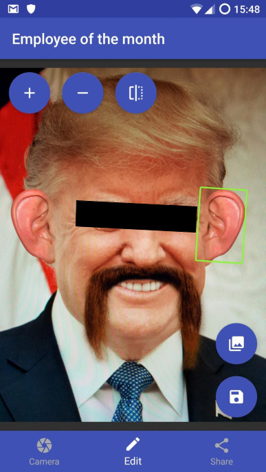

# Employee of the month
## What is it?
This is the Android app I wrote for the last programming assignment of my first year in studying Software Development at NOVI Hogeschool (Netherlands). It is also the first-ever Android app I wrote.
## What does it do?
It's kind of a poor man's Snapchat clone, meaning you can take pictures (of someone) with it, overlay funny stuff (like beards, ears and the like) and share the result.
## Source material
The app uses (modified versions of) code from the following GitHub projects:
- [Camera2Basic](https://github.com/googlesamples/android-Camera2Basic)
- [Glide](https://github.com/bumptech/glide)
- [MotionViews-Android](https://github.com/uptechteam/MotionViews-Android)
- [Android Gesture Detectors](https://github.com/Almeros/android-gesture-detectors)

Hopefully you have as much fun with it as I did.
